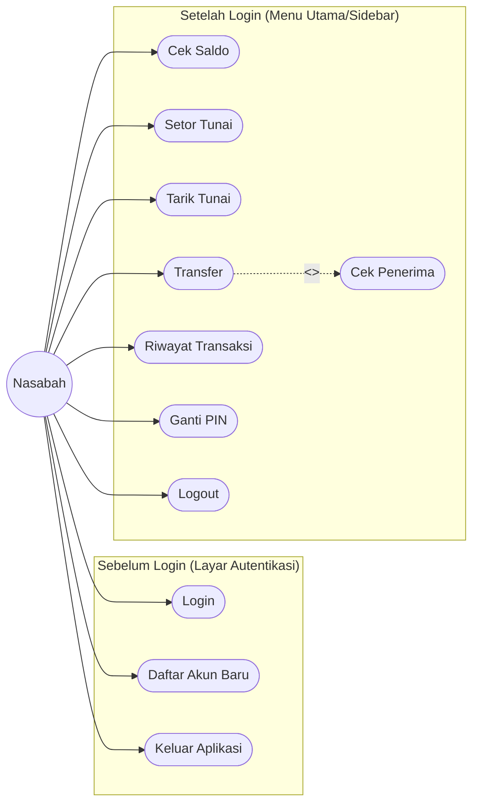
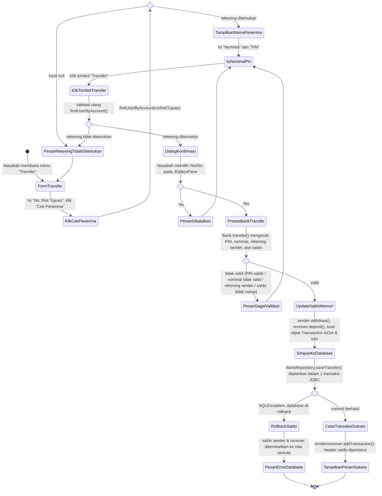
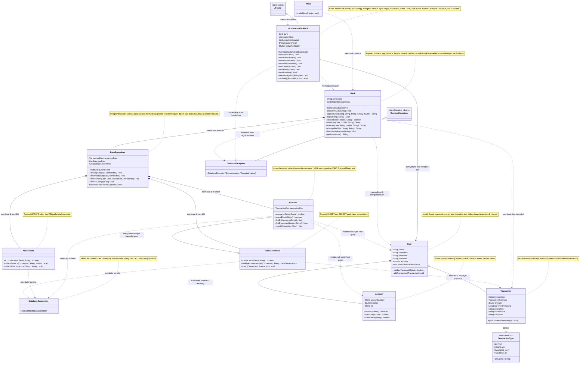
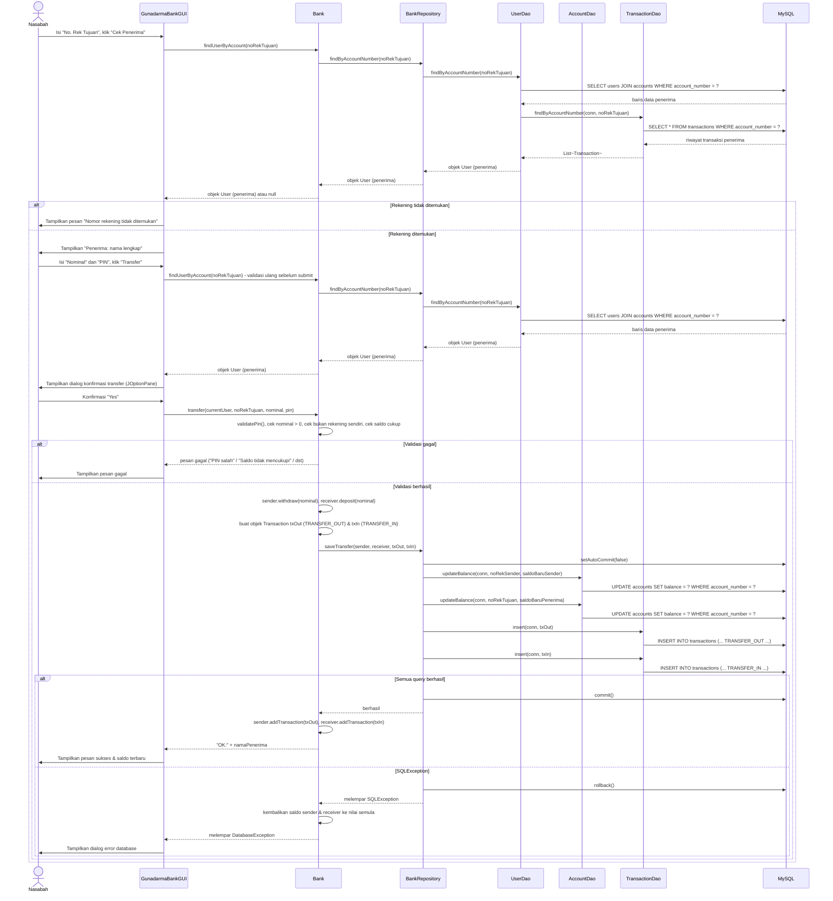
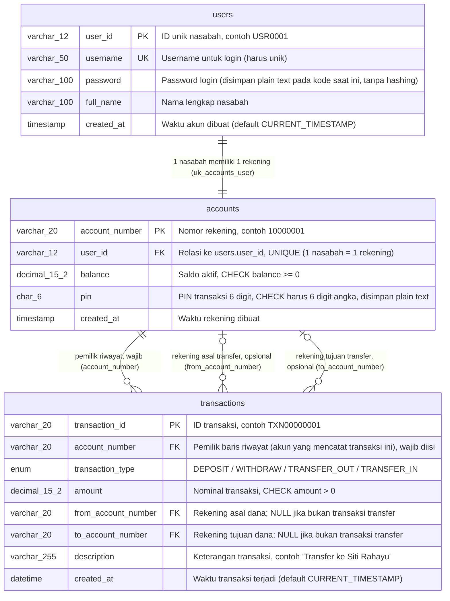
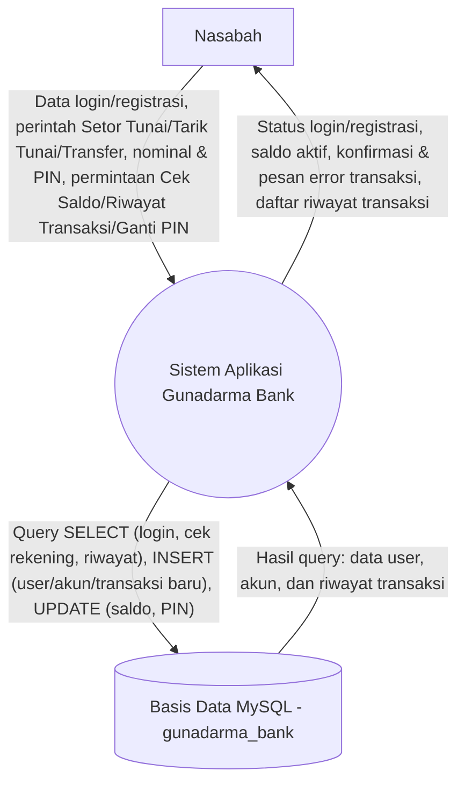

# Gunadarma Bank - Java Swing Desktop Banking

## Project Overview

Gunadarma Bank is a Java desktop banking application built with Swing and backed by a MySQL database. Customers can register, log in, view account details, deposit funds, withdraw funds, transfer to another account, review recent transactions, and change their PIN.

The application now runs as a GUI-only desktop application through `mbanking.Main`. The banking service, validation rules, transaction sequence, account model, and database schema are preserved.

## Features

- Customer login with username and password.
- New account registration with 6-digit PIN validation.
- Dashboard with customer name, account number, and active balance.
- Balance inquiry.
- Cash deposit with PIN validation.
- Cash withdrawal with PIN and balance validation.
- Transfer with receiver lookup, confirmation dialog, PIN validation, and sender/receiver transaction records.
- Recent transaction history, newest first, limited to the latest 10 transactions.
- PIN change with old PIN validation and new PIN confirmation.
- MySQL persistence for users, accounts, balances, PIN changes, and transaction history.
- Demo users seeded by the database script and guarded by the service initializer.
- Gunadarma Bank logo applied in the authentication and dashboard shell.

## Technologies Used

- Java 17 or newer recommended.
- Java Swing and AWT for the desktop user interface.
- JDBC for database access.
- MySQL 8 or newer.
- MySQL Connector/J at runtime.
- Mermaid for UML documentation in this README.

## Folder Structure

```text
mbanking/
|-- assets/
|   `-- logo.png
|-- database/
|   `-- gunadarma_bank.sql
|-- src/
|   `-- mbanking/
|       |-- Main.java
|       |-- config/
|       |   `-- DatabaseConnection.java
|       |-- dao/
|       |   |-- AccountDao.java
|       |   |-- DatabaseException.java
|       |   |-- TransactionDao.java
|       |   `-- UserDao.java
|       |-- enums/
|       |   `-- TransactionType.java
|       |-- gui/
|       |   `-- GunadarmaBankGUI.java
|       |-- model/
|       |   |-- Account.java
|       |   |-- Transaction.java
|       |   `-- User.java
|       |-- repository/
|       |   `-- BankRepository.java
|       |-- service/
|       |   `-- Bank.java
|       `-- util/
|           |-- Formatter.java
|           `-- IDGenerator.java
`-- README.md
```

Important directories:

- `assets`: visual assets used by the GUI.
- `database`: MySQL schema and sample data.
- `src/mbanking/gui`: Swing screens, layout, event handlers, and GUI styling.
- `src/mbanking/service`: banking business facade.
- `src/mbanking/repository`: transaction-safe persistence coordination.
- `src/mbanking/dao`: direct JDBC operations.
- `src/mbanking/model`: domain objects.

## Installation

1. Install MySQL Server 8 or newer.
2. Create the database and sample data:

```powershell
mysql -u root -p < database\gunadarma_bank.sql
```

3. Place MySQL Connector/J in a local `lib` folder, for example:

```text
lib/mysql-connector-j-9.3.0.jar
```

4. Compile the Java source:

```powershell
$files = Get-ChildItem -Path src -Recurse -Filter *.java | ForEach-Object { $_.FullName }
javac -d out $files
```

5. Run the GUI application:

```powershell
java -cp "out;lib\mysql-connector-j-9.3.0.jar" mbanking.Main
```

Run with explicit database credentials:

```powershell
java -Ddb.user="root" -Ddb.password="your_password" -cp "out;lib\mysql-connector-j-9.3.0.jar" mbanking.Main
```

Database configuration priority:

1. JVM properties: `db.url`, `db.user`, `db.password`
2. Environment variables: `GUNADARMA_DB_URL`, `GUNADARMA_DB_USER`, `GUNADARMA_DB_PASSWORD`
3. Environment variables: `DB_URL`, `DB_USER`, `DB_PASSWORD`
4. Defaults in `DatabaseConnection`

Default JDBC URL:

```text
jdbc:mysql://localhost:3306/gunadarma_bank?useSSL=false&serverTimezone=Asia/Jakarta&allowPublicKeyRetrieval=true
```

## Sample Credentials

| Name | Username | Password | PIN | Account Number | Initial Balance |
|---|---|---|---|---|---|
| Budi Santoso | `budi` | `budi123` | `123456` | `10000001` | Rp5,000,000 |
| Siti Rahayu | `siti` | `siti123` | `654321` | `10000002` | Rp3,000,000 |

## Screenshots

Screenshots are not included in this repository yet.

| Screen | Placeholder |
|---|---|
| Login and registration | `docs/screenshots/login.png` |
| Dashboard and balance | `docs/screenshots/dashboard.png` |
| Transfer | `docs/screenshots/transfer.png` |
| Transaction history | `docs/screenshots/history.png` |

## Arsitektur & Alur Sistem (System Architecture & Flow)

Bagian ini menjelaskan arsitektur dan alur kerja aplikasi Gunadarma Bank secara visual menggunakan diagram Mermaid. Seluruh diagram disusun berdasarkan analisis langsung terhadap kode sumber (`src/mbanking`) dan skema database (`database/gunadarma_bank.sql`), sehingga mencerminkan logika aplikasi yang sesungguhnya.

### 1. Diagram Use Case (Use Case Diagram)

Diagram ini memetakan seluruh aksi yang dapat dilakukan Nasabah, berdasarkan menu yang tersedia di layar autentikasi (`createAuthPanel`) dan sidebar navigasi (`createSidebar`) pada `GunadarmaBankGUI`.



Keterangan:

- `Login` dan `Daftar Akun Baru` merupakan dua tab pada layar autentikasi (`createLoginPanel`, `createRegisterPanel`).
- `Keluar Aplikasi` adalah tombol "Keluar" pada layar Login yang memanggil `dispose()`, berbeda dengan `Logout` pada sidebar yang memanggil `logout()` (kembali ke layar Login tanpa menutup aplikasi).
- `Cek Penerima` bersifat `<<include>>` terhadap `Transfer`, karena `showTransferView()` mewajibkan nasabah memvalidasi rekening tujuan (`bank.findUserByAccount`) sebelum tombol submit "Transfer" dapat berhasil diproses.

### 2. Diagram Aktivitas Alur Transfer (Activity Diagram)

Diagram ini menelusuri proses transaksi Transfer secara rinci, mulai dari input di `showTransferView()`, validasi bisnis di `Bank.transfer()`, hingga penyimpanan ke database melalui `BankRepository.saveTransfer()`.



### 3. Diagram Kelas (Class Diagram)

Diagram ini merepresentasikan struktur kode utama aplikasi: lapisan antarmuka (`gui`), lapisan layanan (`service`), lapisan repository/DAO (`repository`, `dao`), dan model domain (`model`, `enums`). Nama kelas, atribut, dan method ditulis sesuai kode asli; penjelasan setiap kelas diberikan dalam catatan berbahasa Indonesia.



### 4. Diagram Sekuens Alur Transfer (Sequence Diagram)

Diagram ini menunjukkan komunikasi antar objek secara berurutan untuk proses Transfer, dari `GunadarmaBankGUI` hingga MySQL, termasuk jalur gagal (rekening tidak ditemukan, validasi gagal, dan error database).



### 5. Diagram Relasi Entitas / ERD (Entity Relationship Diagram)

Diagram ini memetakan skema database persis seperti yang didefinisikan pada `database/gunadarma_bank.sql`, termasuk primary key, foreign key, dan batasan (constraint) tiap tabel.



Catatan tambahan sesuai skema SQL:

- Semua tabel menggunakan engine `InnoDB` agar mendukung foreign key dan transaksi (COMMIT/ROLLBACK).
- Relasi `users` ke `accounts` bersifat satu-ke-satu karena kolom `accounts.user_id` diberi batasan `UNIQUE` (`uk_accounts_user`), bukan sekadar foreign key biasa.
- Kolom `from_account_number` dan `to_account_number` pada `transactions` bersifat nullable karena hanya diisi untuk transaksi bertipe `TRANSFER_OUT`/`TRANSFER_IN`; untuk `DEPOSIT`/`WITHDRAW`, kedua kolom ini bernilai NULL (lihat `TransactionDao.normalizeAccountNumber`).

### 6. Diagram Alir Data Level 0 / Context Diagram (Data Flow Diagram)

Diagram ini menunjukkan aliran data tingkat tertinggi antara Nasabah (entitas eksternal), Sistem Aplikasi Gunadarma Bank (satu proses tunggal), dan Basis Data MySQL (penyimpanan data), tanpa merinci proses internal (sesuai definisi DFD Level 0/Context Diagram).



## Database Notes

The database script creates:

- `users`: user identity and login credentials.
- `accounts`: account number, balance, PIN, and user ownership.
- `transactions`: deposit, withdrawal, transfer-in, and transfer-out history.

Transfer persistence creates two transaction rows in one JDBC transaction:

- `TRANSFER_OUT` owned by the sender account.
- `TRANSFER_IN` owned by the receiver account.

## Troubleshooting

`MySQL JDBC Driver tidak ditemukan`

- Confirm MySQL Connector/J is present in `lib`.
- Confirm the jar filename in the `-cp` command matches the actual file.

`Unknown database gunadarma_bank`

- Run `database/gunadarma_bank.sql` before launching the app.

`Access denied for user`

- Check `db.user`, `db.password`, or the matching environment variables.

`Communications link failure`

- Start MySQL Server and confirm the URL host and port.
