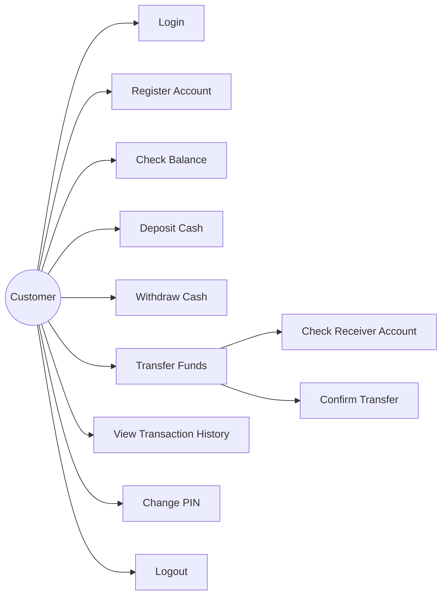
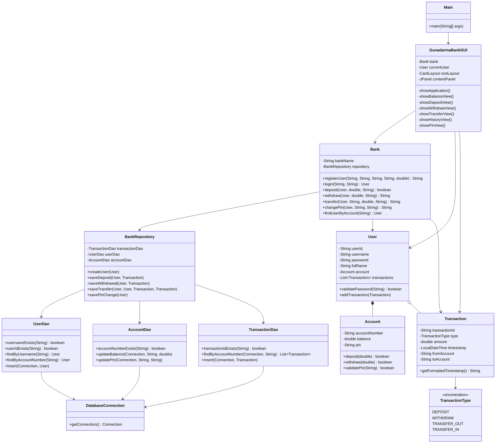
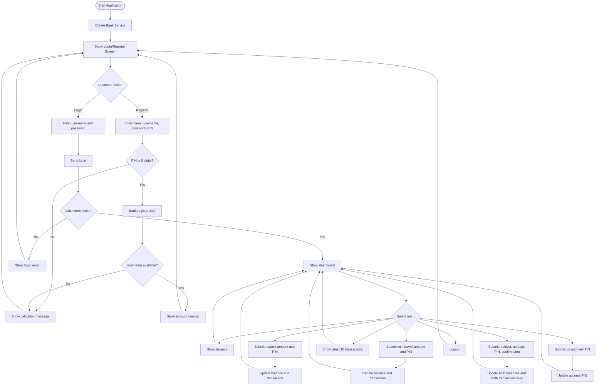
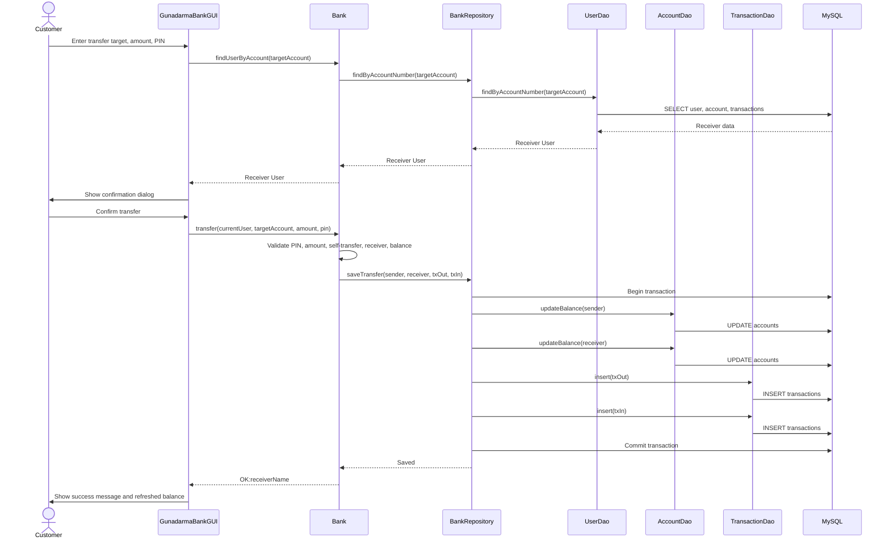
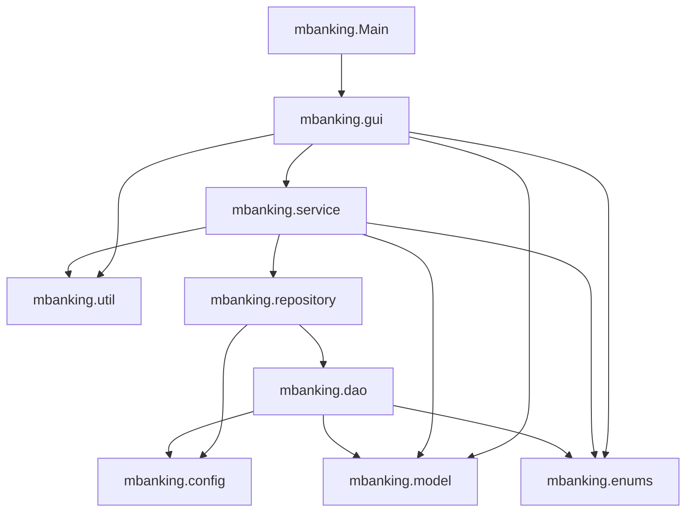

# Gunadarma Bank - Java Swing Mobile Banking

## Project Overview

Gunadarma Bank is a Java desktop banking application built with Swing and backed by a MySQL database. Customers can register, log in, view account details, deposit funds, withdraw funds, transfer to another account, review recent transactions, and change their PIN.

The application now runs as a GUI-only desktop application through `mbanking.Main`. The banking service, validation rules, transaction sequence, account model, and database schema are preserved.

## Features

- Customer login with username and password.
- New account registration with 6-digit PIN validation.
- Dashboard with customer name, account number, and active balance.
- Balance inquiry.
- Cash deposit with PIN validation.
- Cash withdrawal with PIN and balance validation.
- Transfer with receiver lookup, confirmation dialog, PIN validation, and sender/receiver transaction records.
- Recent transaction history, newest first, limited to the latest 10 transactions.
- PIN change with old PIN validation and new PIN confirmation.
- MySQL persistence for users, accounts, balances, PIN changes, and transaction history.
- Demo users seeded by the database script and guarded by the service initializer.
- Gunadarma Bank logo applied in the authentication and dashboard shell.

## Technologies Used

- Java 17 or newer recommended.
- Java Swing and AWT for the desktop user interface.
- JDBC for database access.
- MySQL 8 or newer.
- MySQL Connector/J at runtime.
- Mermaid for UML documentation in this README.

## Folder Structure

```text
mbanking/
|-- assets/
|   `-- logo.png
|-- database/
|   `-- gunadarma_bank.sql
|-- src/
|   `-- mbanking/
|       |-- Main.java
|       |-- config/
|       |   `-- DatabaseConnection.java
|       |-- dao/
|       |   |-- AccountDao.java
|       |   |-- DatabaseException.java
|       |   |-- TransactionDao.java
|       |   `-- UserDao.java
|       |-- enums/
|       |   `-- TransactionType.java
|       |-- gui/
|       |   `-- GunadarmaBankGUI.java
|       |-- model/
|       |   |-- Account.java
|       |   |-- Transaction.java
|       |   `-- User.java
|       |-- repository/
|       |   `-- BankRepository.java
|       |-- service/
|       |   `-- Bank.java
|       `-- util/
|           |-- Formatter.java
|           `-- IDGenerator.java
`-- README.md
```

Important directories:

- `assets`: visual assets used by the GUI.
- `database`: MySQL schema and sample data.
- `src/mbanking/gui`: Swing screens, layout, event handlers, and GUI styling.
- `src/mbanking/service`: banking business facade.
- `src/mbanking/repository`: transaction-safe persistence coordination.
- `src/mbanking/dao`: direct JDBC operations.
- `src/mbanking/model`: domain objects.

## Installation

1. Install MySQL Server 8 or newer.
2. Create the database and sample data:

```powershell
mysql -u root -p < database\gunadarma_bank.sql
```

3. Place MySQL Connector/J in a local `lib` folder, for example:

```text
lib/mysql-connector-j-9.3.0.jar
```

4. Compile the Java source:

```powershell
$files = Get-ChildItem -Path src -Recurse -Filter *.java | ForEach-Object { $_.FullName }
javac -d out $files
```

5. Run the GUI application:

```powershell
java -cp "out;lib\mysql-connector-j-9.3.0.jar" mbanking.Main
```

Run with explicit database credentials:

```powershell
java -Ddb.user="root" -Ddb.password="your_password" -cp "out;lib\mysql-connector-j-9.3.0.jar" mbanking.Main
```

Database configuration priority:

1. JVM properties: `db.url`, `db.user`, `db.password`
2. Environment variables: `GUNADARMA_DB_URL`, `GUNADARMA_DB_USER`, `GUNADARMA_DB_PASSWORD`
3. Environment variables: `DB_URL`, `DB_USER`, `DB_PASSWORD`
4. Defaults in `DatabaseConnection`

Default JDBC URL:

```text
jdbc:mysql://localhost:3306/gunadarma_bank?useSSL=false&serverTimezone=Asia/Jakarta&allowPublicKeyRetrieval=true
```

## Sample Credentials

| Name | Username | Password | PIN | Account Number | Initial Balance |
|---|---|---|---|---|---|
| Budi Santoso | `budi` | `budi123` | `123456` | `10000001` | Rp5,000,000 |
| Siti Rahayu | `siti` | `siti123` | `654321` | `10000002` | Rp3,000,000 |

## Screenshots

Screenshots are not included in this repository yet.

| Screen | Placeholder |
|---|---|
| Login and registration | `docs/screenshots/login.png` |
| Dashboard and balance | `docs/screenshots/dashboard.png` |
| Transfer | `docs/screenshots/transfer.png` |
| Transaction history | `docs/screenshots/history.png` |

## UML Documentation

### 1. Use Case Diagram



### 2. Class Diagram



### 3. Activity Diagram



### 4. Sequence Diagram



### 5. Package Diagram



## Database Notes

The database script creates:

- `users`: user identity and login credentials.
- `accounts`: account number, balance, PIN, and user ownership.
- `transactions`: deposit, withdrawal, transfer-in, and transfer-out history.

Transfer persistence creates two transaction rows in one JDBC transaction:

- `TRANSFER_OUT` owned by the sender account.
- `TRANSFER_IN` owned by the receiver account.

## Troubleshooting

`MySQL JDBC Driver tidak ditemukan`

- Confirm MySQL Connector/J is present in `lib`.
- Confirm the jar filename in the `-cp` command matches the actual file.

`Unknown database gunadarma_bank`

- Run `database/gunadarma_bank.sql` before launching the app.

`Access denied for user`

- Check `db.user`, `db.password`, or the matching environment variables.

`Communications link failure`

- Start MySQL Server and confirm the URL host and port.
